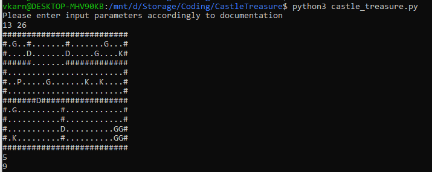

# Castle's treasure
This is solution for the challenge from technical part evaluation for robotics course.
You can find original description of the task in the file _task_desciprion.pdf_ in the repository.

**! Important**
1. Solution of the last example from original task description is wrong. Correct number of max coins is 9, not 10.
2. Originally task says nothing about condition of output. Should we achieve maximum visited room and found maximum
number of coins at the same time or not. This solution assummes that we are interested in optimization of both these 
parameters separately.

# Files
- _castle_treasure.py_ - file with the solution
- _tests.py_ - tests suit for the solution
- _task_description.pdf_ - original task description in PDF format
- _README.md_ - documentation


# How to run?
To execute code you need to run _castle_treasure.py_ and enter input values line by line:

Command to run:
_python3 castle_treasure.py_

No any additional requirements except Python.
See how it should look like on the screenshot below:



**Input parameters**:
Two integers N, M representing the height and width of the map, respectively. The next N lines contain
M characters describing the map, like this:
```angular2html
    ##########################
    #.G..#.......#.......G...#
    #....D.......D.....G....K#
    ######.......#############
    #........................#
    #..P.....G.......K..K....#
    #........................#
    #######D##################
    #.G.........#............#
    #...........#............#
    #...........D..........GG#
    #.K.........#..........GG#
    ##########################
```


**Output**:
1. The maximum number of rooms that can be visited, Q.
2. The maximum number of coins that can be collected, W.

Map Notations:

- "#" - Wall
- "." - Floor or empty cell
- "D" - Door
- "K" - Key
- "P" - Your starting coordinates
- "G" - Gold coin


Tested using python3.7 and python3.10.


# Tests
You can find tests suit in tests.py file. Just execute this file using python 
and it will show if anything is wrong.  You can try to break the code.

Command to run:
_python3 tests.py_


# How to read the code?
In the end of the _castle_treasure.py_ file you may find execution entry point.
This if statement is responsible for input parsing 
(using utility _parse_numbers_ from the top of the file) and delegating further execution to
_find_castle_treasure_ function which contains all the logic.
You can also find helpful docstring for statements which can be unclear.
